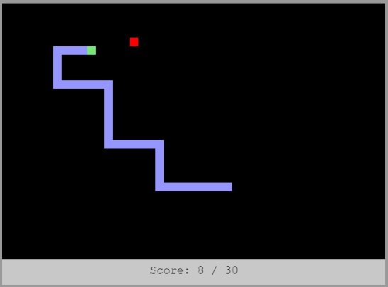

# HTML5 Snake

A Snake / Nibbles clone using JavaScript and the browser's HTML5 Canvas.

[Try It Here](https://andrew-lim.github.io/html5-snake/snake.htm)

The main difference between this and most other snake clones is that the arrow key inputs are stored in a queue. This saves quick inputs and helps when turning the snake.